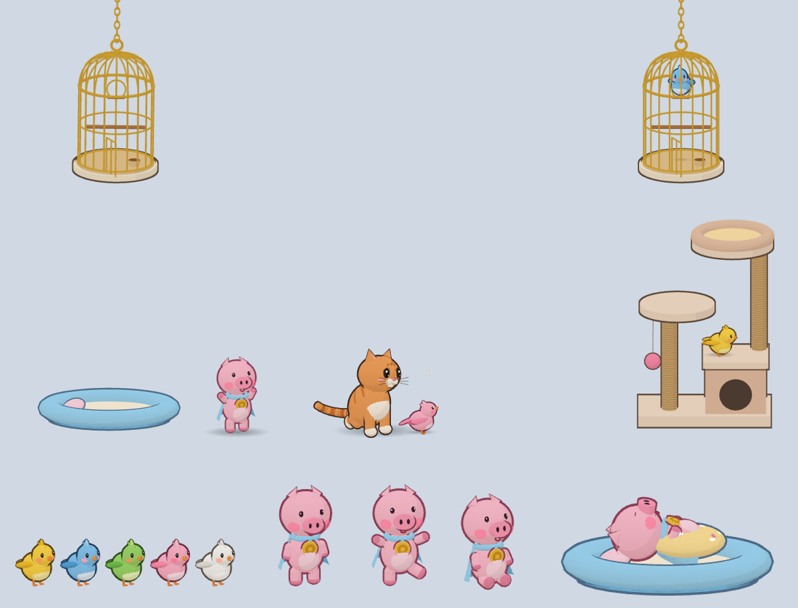
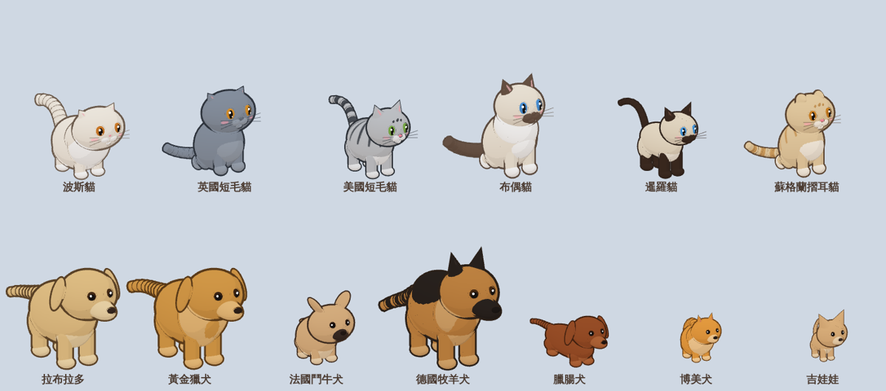
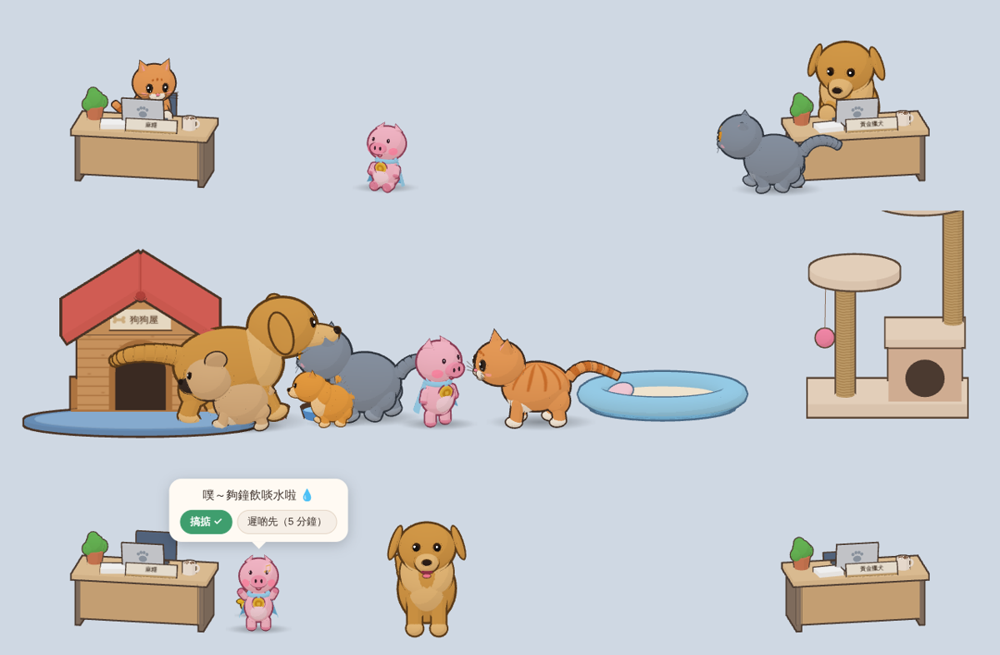
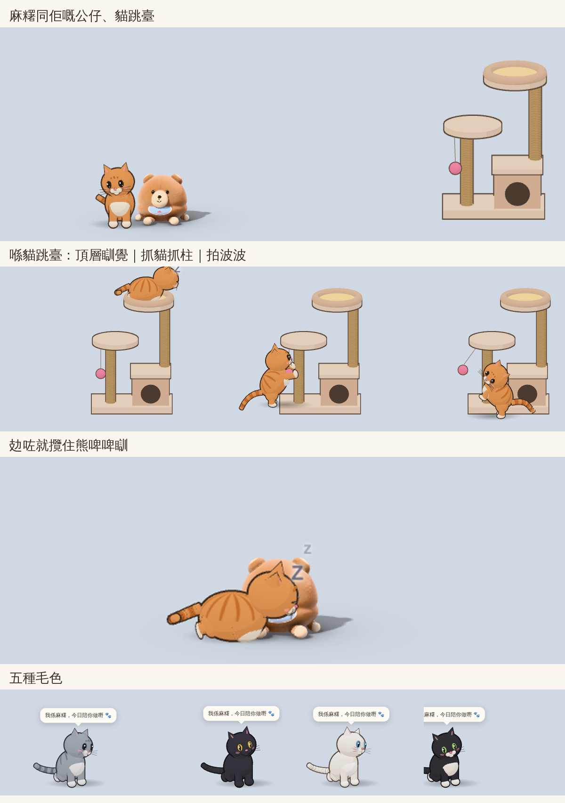

# 桌面貓貓 🐾

一隻 3D 貓貓喺你個桌面底部行嚟行去，自己玩自己嘅：散步、跑圈、坐低、舔毛、伸懶腰、打喊路、瞓覺，間中仲會追你個滑鼠。佢有自己嘅貓跳臺，又會同你整嘅軟膠公仔玩。仲有最多 3 隻雀仔（5 隻顏色任揀），佢哋嘅鳥籠吊喺螢幕左上同右上；另外有隻披住淺藍色斗篷、掛住金幣嘅粉紅豬仔「布甸」，佢有自己張床。仲可以揀 7 種狗狗同 6 種貓貓做朋友，一齊喺桌面生活，狗狗有自己間狗屋；主角（負責提醒你嗰隻）可以係貓、狗、雀仔或者豬仔；開「辦公室模式」仲會有兩隻坐喺工作枱度陪你一齊返工。有幾個螢幕都可以揀佢哋喺邊個螢幕出現。佢每 30 分鐘會輪流提你飲水、休息、去廁所。

成個介面都係香港繁體中文。









## 下載（免安裝）

1. 去呢個 repo 嘅 **Actions** → **Build Desktop Cat** → 揀最新一次（有綠色剔嗰次）。
2. 喺頁面底部 **Artifacts** 下載：
   - **Windows**：`DesktopCat-Windows`。解壓後得一個 `DesktopCat-1.6.0.exe`，**撳兩下就開，唔使安裝**。唔要嘅時候直接刪咗個檔案就得。
   - **Mac**：`DesktopCat-macOS`。解壓後再解壓入面嘅 zip，得到 `DesktopCat.app`，撳兩下就開。
3. 第一次開：
   - **Windows**：因為冇數碼簽署，可能會彈「Windows 已保護您的電腦」。撳「其他資訊」→「仍要執行」。每次開都要等幾秒，因為佢會先自己解壓。
   - **Mac**：如果話「無法打開」，去「系統設定」→「私隱與安全性」，喺下面撳「仍要打開」。

**緊急離開：Ctrl+Alt+Q**（Mac：Cmd+Alt+Q），滑鼠撳唔到嘢都用得。

## 點用

- 貓貓會喺螢幕底部（工作列上面）出現。除咗貓貓同公仔，其他地方照常撳到你啲程式。
- **撳一下貓貓**：摸摸佢 💗
- **滑鼠喺佢身上掃嚟掃去**：掃毛，佢會呼嚕呼嚕
- **撳住拖走**：揸起佢；放手佢會跌返落地。喺貓跳臺上面放手，佢會企喺嗰層。
- **滑鼠喺螢幕底部快快郁**：佢可能會撲過嚟玩
- **右撳貓貓**，或者撳工作列右下角（Mac：螢幕頂嘅選單列）嘅貓貓圖示，就會開選單：暫停／繼續提醒、即刻提醒一次、叫主角過嚟、收埋佢哋、辦公室模式、主角、公仔、雀仔、豬仔、朋友（連狗屋）、螢幕、貓跳臺、設定、離開。

## 主角

負責提醒你嗰隻叫「主角」，喺設定「主角」或者選單「主角」度揀：

- **貓貓**（預設）：可以揀普通貓再揀毛色，或者 6 種貓嘅品種。
- **狗狗**：揀 7 種狗嘅品種。狗狗主角唔會爬貓跳臺，但會吠、伸脷搖尾、去狗屋瞓、去碗度食嘢。
- **雀仔**：第 1 隻雀仔做主角，提醒嗰陣會飛落地對住你唱歌。
- **豬仔**：豬仔做主角，提醒嗰陣會企喺度舉高手揮。

主角個名就係設定入面嘅「名」；提醒對話框會喺主角個頭上面出，佢叫嘅聲（喵／汪／啾／噗）都會跟住變。主角唔係貓貓或者狗狗嘅時候，原本嗰隻貓會收埋。

## 辦公室模式

喺設定「辦公室模式」或者選單剔「辦公室模式」：

- 螢幕左右兩邊會擺兩張工作枱：手提電腦、咖啡杯、盆栽、文件，前面仲有寫住名嘅名牌，後面有張辦公椅。
- 揀兩隻動物返工（主角、豬仔或者任何一隻朋友；預設係主角加一隻自動揀）。佢哋會行到枱邊、跳上櫈，前腳放喺鍵盤度打字（會出「噠噠噠」）。間中會諗嘢（💡）、飲咖啡（☕）、伸懶腰、望吓你，甚至瞌埋眼瞓着。雀仔做主角嘅話，就會企喺枱面啄鍵盤打字。
- 做幾分鐘就會落嚟休息一兩分鐘，再返去做；夠鐘提醒嘅時候佢哋都會停手，走埋嚟陪你。
- 辦公室模式期間，貓跳臺、豬仔床同狗屋會暫時收埋，熄返就會再出現。

## 貓跳臺

有底座、小屋、兩條麻繩貓抓柱、一層平台、頂層一張圓床，仲有個吊住嘅粉紅色波波。貓貓會自己爬上去坐、喺頂層張床瞓覺、企起身抓柱、拍個波波。可以喺設定或者選單揀放喺右邊、左邊或者唔要。

## 雀仔

最多 3 隻雀仔，預設係黃色「檸檬」、藍色「藍莓」同粉紅色「蜜桃」。隻數、每隻嘅名同顏色（黃、藍、綠、粉紅、白）都可以喺設定改。

- 兩個金色鳥籠用鏈吊喺螢幕**左上角同右上角**（可以揀淨係一邊或者唔要），會輕輕擺吓，有雀仔企上去會擺多啲。鳥籠底下嘅位照樣撳到你啲程式。
- 雀仔喺地上跳嚟跳去、啄嘢、梳毛、唱歌（會出 ♪）、拍翼伸展，四圍飛。
- 會企喺鳥籠頂、鳥籠入面嘅鞦韆、貓跳臺、公仔頭頂，甚至貓貓或者豬仔個頭上面（佢哋坐定或者瞓緊先會）。同一個位一次只企到一隻。
- 攰咗就飛返上自己個鳥籠（兩個籠都喺度嘅話，雀仔會分開住），由籠門飛入去，企喺棲木上面縮埋一嚿瞓覺。
- 貓貓見到佢哋飛會望住；有雀仔落咗地，貓貓有時會伏低擰屁股撲過去，附近啲雀仔會一齊飛走，貓貓一定捉唔到。
- **撳一下雀仔**：佢會唱歌；**拖住佢**：佢會拍翼，放手就飛走。
- 夠鐘提醒嘅時候，雀仔會飛埋貓貓隔籬一齊唱歌。

## 豬仔

粉紅色豬仔「布甸」（個名可以改），大大個頭、紅粉粉嘅面珠、披住淺藍色斗篷，心口掛住個金幣：

- 周圍行、小跑、用個鼻喺地下索嚟索去、坐低、反轉身踢腳仔、單腳跳舞（會轉圈同出 ♪），有時會跟住貓貓周圍行。
- 貓貓會行埋去同佢打招呼，兩個都會出心心。
- 攰咗就行返自己張床（淺藍色圓床，有個枕頭），跳入去瞓低、蓋好張有波點嘅被。床可以放喺左邊、右邊或者唔要。
- **撳一下豬仔**：佢會跳舞；**拖住佢**：佢會踢腳仔，放手就跌返落地。
- 夠鐘提醒嘅時候，豬仔會走埋嚟舉高雙手幫你打氣。

## 狗屋

有狗狗（朋友或者主角）嘅時候，地下會有一間紅屋頂嘅木狗屋，門口有張墊，隔籬有一碗狗糧同一碗水：

- 狗狗攰咗會返狗屋：第一隻會瞓喺門口（得個頭伸出嚟），其他會瞓喺張墊上面，擠埋一齊。
- 狗狗同貓貓肚餓會去碗度食嘢飲水（會出「嚼嚼」、「咕嚕咕嚕」），一個碗一次一隻。
- 雀仔會企喺狗屋屋頂。
- 狗屋可以放喺左邊、右邊或者唔要（設定「狗狗同貓貓朋友」或者選單「朋友」）。

## 狗狗同貓貓朋友

喺設定「狗狗同貓貓朋友」或者選單「朋友」度剔，想要幾多隻都得（預設有黃金獵犬同英國短毛貓）：

- 🐶 狗狗：拉布拉多、黃金獵犬、法國鬥牛犬、德國牧羊犬、臘腸犬、博美犬、吉娃娃
- 🐱 貓貓：波斯貓、英國短毛貓、美國短毛貓、布偶貓、暹羅貓、蘇格蘭摺耳貓

每隻都有自己嘅樣：大細、身形、腳長短、耳仔（企耳、摺耳、垂耳、蝙蝠耳）、尾、毛色同眼色都唔同，例如臘腸犬長身短腳，暹羅貓同布偶貓有深色嘅面、耳仔同尾。

- 佢哋會周圍行、坐低、瞓覺、伸懶腰；貓貓會舔毛，狗狗會周圍索、伸脷喘氣、搖尾、吠兩聲（會出「汪！」），間中伏低再跑幾個圈。
- 會互相行埋去打招呼，又會跟住主角行；主角都會行去探佢哋。
- 動物之間嘅互動：
  - 狗狗會衝去追貓貓，貓貓會走佬（間中仲會「嘶～」）；追主角貓貓都一樣。
  - 狗狗會對其他狗狗或者豬仔伏低擰尾邀佢玩，跟住一齊跑圈；豬仔會跳舞。
  - 貓貓會伏低擰屁股撲雀仔，狗狗會衝去對住雀仔吠，雀仔一定飛走。
  - 狗狗會用鼻同手推公仔。
  - 攰咗會瞓埋去其他瞓緊嘅動物隔籬。
  - 你摸其中一隻，附近嘅會走埋嚟「爭寵」（「我都要摸摸！」），豬仔都會。
- 夠鐘提醒或者撳「叫貓貓過嚟」，朋友都會走埋嚟陪你。
- **撳一下**：佢哋會開心（狗狗會搖尾、跳兩下）；**拖住佢哋**：可以揸起，放手會跌返落地。
- 朋友越多，部電腦越辛苦；舊啲嘅電腦建議唔好開太多隻。

主角貓貓自己都可以揀品種：設定「貓貓」度嘅「品種」可以揀上面 6 種貓，或者「普通貓」再揀毛色。

## 幾個螢幕

設定「聲音、螢幕同其他」或者選單「螢幕」度可以揀：

- **主螢幕**（預設）或者**指定某一個螢幕**：貓貓同所有朋友、雀仔、豬仔都會搬去嗰個螢幕。
- **跟住滑鼠**：滑鼠喺另一個螢幕停留兩秒，佢哋就跟住搬過去。
- 選單「螢幕」→「搬去下一個螢幕」可以一撳就搬。
- 揀咗嘅螢幕拔走咗，佢哋會返去主螢幕；再插返就會搬返去。

## 公仔

你喺 `plush-octopus` 分支整嘅五隻軟膠公仔：熊啤啤、八爪魚、Hello Kitty、姆明、高速婆婆。預設出咗熊啤啤同八爪魚，其他可以喺設定或者選單「公仔」度開。

- 貓貓會行埋去用手撥佢、伏低擰兩擰屁股再撲上去壓扁佢、咬住佢拖去第二度（間中仲會拖嚟送俾你 🎁），攰咗就攬住佢瞓。
- 你都可以拖公仔、掟公仔；掟得快，貓貓見到會追過去。
- 公仔原本用 WebGPU 畫；喺貓貓 app 入面，佢哋同貓貓一樣用 WebGL 畫（WebGL 差唔多所有電腦都得），個樣同原本一樣。WebGL 畫唔到先會試 WebGPU。
- 公仔越多，部電腦越辛苦。

### 見唔到公仔？

右撳貓貓 →「複製診斷資料」，貼俾幫你整貓貓嘅人。入面有你部電腦嘅顯示卡，同每隻公仔用咩畫、有冇畫到、喺畫面邊度。

## 提醒

- 每隔 30 分鐘（設定入面可以改 15–90 分鐘），輪住提：💧 飲水 → 🙆 休息伸展 → 💧 飲水 → 🚽 去廁所。
- 夠鐘嘅時候，貓貓會行埋嚟坐低望住你、跳兩下、喵兩聲，再出對話框，同埋彈系統通知。
- 撳「**搞掂 ✓**」會記低一次；撳「**遲啲先（5 分鐘）**」就 5 分鐘之後再提。唔理佢嘅話，每 5 分鐘再喵一次，最多 3 次。
- 如果你離開電腦（冇郁滑鼠同鍵盤）超過 5 分鐘，貓貓會當你休息咗，返嚟之後重新計時。

## 設定

右撳貓貓 →「設定…」：

- 主角（貓、狗、雀仔、豬仔）、主角個名、品種（6 種貓或者 7 種狗，或者普通貓）、毛色（橙色虎斑、灰色虎斑、黑貓、白貓、黑白貓）、大細
- 辦公室模式，同邊兩隻坐喺左右兩張枱
- 狗狗同貓貓朋友（13 種任揀）、狗屋位置
- 提醒間隔、提醒邊幾樣、要唔要佢間中講鼓勵說話
- 貓跳臺位置、出嚟玩嘅公仔、公仔大細
- 幾多隻雀仔（0–3）、每隻嘅名同顏色、鳥籠吊喺邊
- 要唔要豬仔、豬仔個名、豬仔床位置
- 喵喵聲、雀仔叫聲、豬仔聲同狗吠聲（預設關咗）、音量、開機自動啟動
- 喺邊個螢幕出現（主螢幕、指定螢幕或者跟住滑鼠）
- 今日紀錄：飲咗幾多杯水、休息咗幾多次、去咗幾多次廁所、摸咗貓貓幾多次

設定同紀錄只會儲喺你自己部電腦。

## 自己改同試

要先裝 [Node.js](https://nodejs.org/)（22 或以上）。

```
cd desktop-cat
npm install
npm start        # 直接開嚟試
npm run dist     # 整免安裝版，放喺 dist/
```

每次 push 改動 `desktop-cat/` 入面嘅檔案，GitHub Actions 都會自動重新整 Windows 同 Mac 版本。

改完公仔之後，用下面呢句將佢哋重新抄入嚟（指向放住 `baby-bear/`、`hello-kitty/` 等資料夾嘅位置，預設係 repo 最頂層）。佢會順便將公仔嘅 WGSL 材質程式翻譯成 WebGL 用嘅 GLSL，所以要先裝 [naga](https://github.com/gfx-rs/wgpu/tree/trunk/naga)（`cargo install naga-cli`）：

```
node scripts/sync-toys.mjs [公仔資料夾]
```

## 檔案

| 路徑 | 用途 |
|---|---|
| `main.js` | 主程式：透明全螢幕視窗（揀邊個螢幕）、工作列圖示、提醒計時、通知、設定儲存 |
| `preload.js` | 主程式同畫面之間嘅橋 |
| `pet/cat.js` | 3D 貓貓（同狗狗）模型同姿勢，按品種砌出唔同樣（用 three.js） |
| `pet/breeds.js` | 13 個品種嘅身形同顏色 |
| `pet/friendbrain.js` | 狗狗同貓貓朋友嘅行為同互動（追、玩、撲雀仔、食嘢、狗屋瞓覺、爭寵、返工） |
| `pet/doghouse.js` | 狗屋、墊同碗 |
| `pet/office.js` | 辦公室模式嘅工作枱，同返工打字嘅動作 |
| `pet/pet.js` | 貓貓嘅行為：行、坐、瞓、追滑鼠、拖放、提醒對話框 |
| `pet/sound.js` | 喵喵聲、呼嚕聲、抓柱聲、雀仔叫聲、豬仔聲、狗吠聲（即場合成，唔使聲音檔） |
| `pet/tree.js` | 貓跳臺 |
| `pet/bird.js` | 雀仔（5 隻顏色）同吊起嘅鳥籠嘅 3D 模型 |
| `pet/birdbrain.js` | 雀仔嘅行為：跳、啄、梳毛、唱歌、飛、瞓覺、避開貓貓 |
| `pet/pig.js` | 豬仔同豬仔床嘅 3D 模型 |
| `pet/pigbrain.js` | 豬仔嘅行為：行、跑、索地、坐、反轉身、跳舞、跟貓貓、返床瞓覺 |
| `pet/toys.js` | 將公仔放入貓貓個視窗，同佢哋傳訊息 |
| `toys/` | 公仔頁面（由 `scripts/sync-toys.mjs` 抄入嚟，加咗同貓貓溝通嘅橋，同翻譯好嘅 WebGL 材質程式） |
| `toys/webgpu-gl.js` | 轉接器：等公仔原本嘅 WebGPU 程式用 WebGL 畫 |
| `settings/` | 設定視窗 |
| `assets/` | 圖示 |
